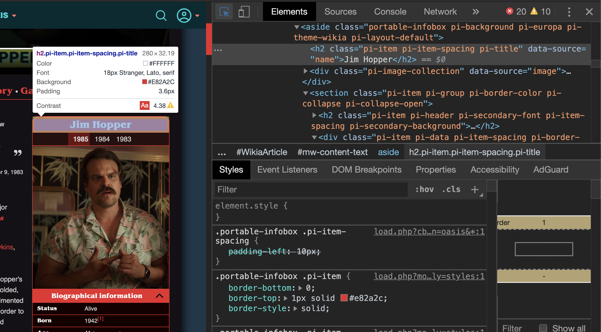

# api-tutorial

## authors

[Paige Gorry](https://github.com/paigeegorry) &&
[Kate Dameron](https://github.com/katedam)

## Getting set up

For this project you'll need to set up a Node.js server. We used Express.js but you can use whatever you want! Check out [this tutorial](https://www.guru99.com/node-js-express.html).

### Things to consider before scraping:
Think about what you are scraping and how often that data changes. 
  ###### If you are scraping data for a streaming service (Netflix, Hulu, etc.), think about how often shows are added to those sites. Do you have a schedule for how you want to maintain your API to keep it up to date? How will you maintain versioning on your API? 

## Step 1: Get set up to scrape some data!

- You will need a parser package (there are 100s of them available so you can use whatever you want). For this project we used [node-html-parser](https://www.npmjs.com/package/node-html-parser).
- You will also need to install an npm package to help with the request. We used [super-agent](https://www.npmjs.com/package/superagent).

run

`npm add -D node-html-parser superagent`

- Now make a _scraper.js_ file at the root of your repo
- Add a function to make the initial request

```
const request = require('superagent');
const { parse } = require('node-html-parser');

const scraper = () => {
  return request
    .get([your url here])
    .then(res => res.text)
    .then(parse)
    .then(console.log);
};

scraper();

module.exports = { scraper };
```

- Now you should be able to run `node scraper.js` and see some html data appear in your console

## Step 2: Make a game plan

Open up your dev tools and inspect the elements that hold the data you need to scrape. In our case, the first thing we needed to do was grab each `h2` header with the class `pi-title`. Here's a screenshot to see what we started with this:



### First things first

- We can grab a series of elements like the `h2` by using the `querySelectorAll` method on the html we get back from the parser. To do this we made a helper function. Be sure to look at the documentation for your npm parser to see what kinds of selectors are available.

```
const titlesList = html => html
  .querySelectorAll('h2 .pi-title')
  .map(node => node.rawText);
```

- add your helper function to your request function

```
const scraper = () => {
  return request
    .get('url')
    .then(res => res.text)
    .then(parse)
    .then(titlesList)
    .then(console.log);
};
```

run `node scraper.js` again

At this point you should be able to see the data and start to make decisions about how to grab different elements, run some clean up functions and start to piece it all together to match your db schema
