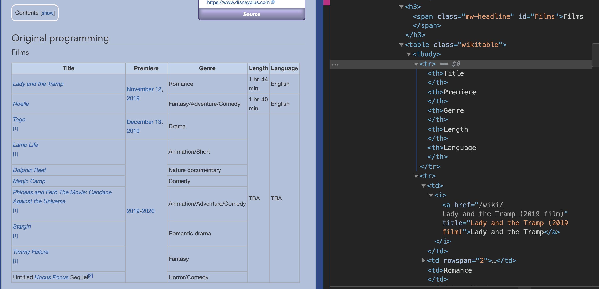

# api-tutorial

## Authors
[Paige Gorry](http://github.com/paigeegorry) && [Kate Dameron](http://github.com/katedam)

## Contribution Policy
Think we missed something? Have additional resources that you want to share? Feel free to submit a PR and contribute to this project! 

## Getting started
This tutorial walks you through creating your own API by data-scraping using a Node.js application with an Express server and NOSQL database (MongoDB). Feel free to substitute your own language, server, and db of choice. 

If you are a beginner, please check out our beginner.md file for resource links. 

<!-- [insert links to setting up a node server with express] -->

What you need to get started: 
- Node.js
- Express
- A website to scrape

### Tips on finding a site to scrape
1. Open up the dev tools! Don't just choose your favorite website, but see what 

## Step 1: Get set up to scrape some data!

- You will need a parser package (there are 100s of them available so you can use whatever you want). For this project we used [node-html-parser](https://www.npmjs.com/package/node-html-parser).
- You will also need to install an npm package to make with the request. We used [super-agent](https://www.npmjs.com/package/superagent).

run `npm add -D node-html-parser superagent` (these are dev dependencies hence the -D)

- Now make a _scraper.js_ file at the root of your repo
- Add a function to make the initial request

```
const request = require('superagent');
const { parse } = require('node-html-parser');

const scraper = () => {
  return request
    .get([your url here])
    .then(res => res.text)
    .then(parse)
    .then(console.log);
};

scraper();

module.exports = { scraper };
```

- Now you should be able to run `node scraper.js` and see some html data appear in your console

## Step 2: Make a game plan

Open up your dev tools and inspect the elements that hold the data you need to scrape. In our case, the first thing we needed to do was grab each `h3` header with the class `mw-headline`. Here's a screenshot to see what we started with this:



### First things first

- We can grab a series of elements like the `h3` by using the `querySelectorAll` method on the html we get back from the parser. To do this we made a helper function. Be sure to look at the documentation for your npm parser to see what kinds of selectors are available.

```
const titlesList = html => html
  .querySelectorAll('h3 .mw-headline')
  .map(node => node.rawText);
```

- add your helper function to your request function

```
const scraper = () => {
  return request
    .get('url')
    .then(res => res.text)
    .then(parse)
    .then(titlesList)
    .then(console.log);
};
```

run `node scraper.js` again

At this point you should be able to see the data and start to make decisions about how to grab different elements, run some clean up functions and start to piece it all together to match your db schema

## Check out our other APIs
* futurama (the api that started it all!)
* last-airbender
* dragon-age
* doctor-who
